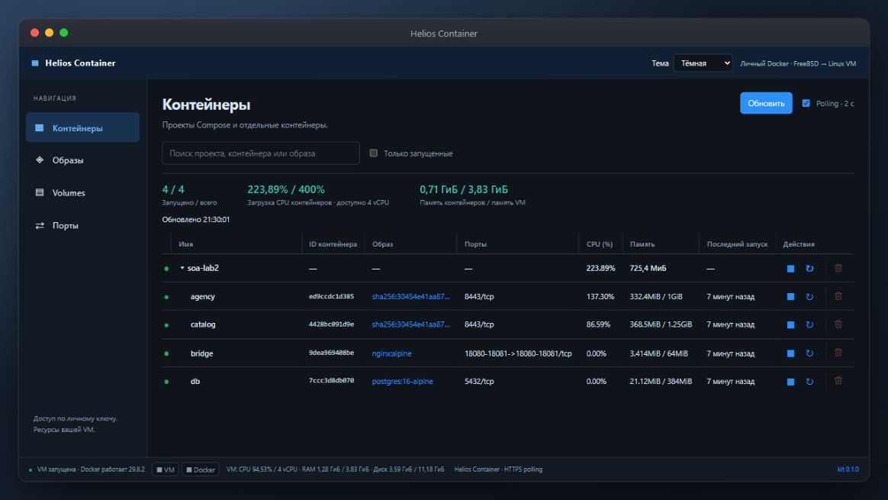

<h1 align="center">Helios Container</h1>
<p align="center">Docker для студентов на helios — без прав администратора.</p>

Личная Linux VM внутри FreeBSD: запускайте Docker-образы и Compose под своим аккаунтом. CPU, память и файлы VM учитываются вашему пользователю.



---

## Быстрый старт

Выполните на helios:

```sh
curl -fsSL https://raw.githubusercontent.com/RedGry/helios-container/main/install.sh | sh && . "$HOME/.profile"
```

Установщик скачивает QEMU и Alpine Linux, настраивает Docker, дожидается готовности VM и добавляет команды в PATH. Первая установка занимает несколько минут.

```sh
docker run --rm hello-world
docker ps
docker compose version
```

При последующих входах `docker` доступен сразу. Если VM остановлена, первая команда `docker` запустит её и дождётся загрузки.

## Ваше приложение

```sh
docker run -d --name web --restart unless-stopped -p 8080:80 nginx:alpine
helios-container forward 8080 28080
```

На своём компьютере откройте SSH-туннель, заменив `USERNAME` на свой логин:

```sh
ssh -p 2222 -N -L 8080:127.0.0.1:28080 USERNAME@se.ifmo.ru
```

Теперь приложение доступно на [localhost:8080](http://localhost:8080). Если порт `28080` занят, выберите другой или выполните `helios-container forward 8080` — свободный порт будет выбран автоматически.

### HTTPS без SSH-туннеля — опционально

Frontend в `~/public_html` может обращаться к backend через веб-шлюз:

```sh
helios-container web install
```

Откройте выданную **приватную ссылку управления**. Во вкладке «Порты» введите `8080, 8081` для портов внутри VM или `host:3000` для своего процесса на helios. Шлюз настроит внутренние пробросы и покажет HTTPS-адреса вида:

```text
https://se.ifmo.ru/~USERNAME/helios-container/index.php/vm/8080/
```

Эти адреса доступны без SSH-туннеля. По умолчанию шлюз выключен. Он поддерживает обычный HTTP API, а авторизацию запросов обеспечивает ваше приложение. [Настройка frontend и ограничения →](docs/web.md)

В панели — контейнеры и проекты Compose, образы, volumes, порты и логи. Можно запускать, останавливать и перезапускать контейнеры и проекты. Просмотр панели не запускает остановленную VM.

Данные обновляются автоматически, пока вкладка видима. Доступны тёмная, светлая и системная темы; браузер запоминает выбор.

## Управление

Панель уведомляет о новых релизах и показывает описание изменений. Обновление сохраняет настройки, SSH-ключи и диск VM.

```sh
helios-container status
helios-container stop
helios-container start
helios-container ssh
```

По умолчанию: **1 CPU · 1 ГиБ RAM · диск до 12 ГиБ**. Диск растёт по мере записи. Для увеличения ресурсов:

```sh
helios-container stop
helios-container configure --memory 4096 --cpus 2
helios-container start
```

Для тяжёлого параллельного запуска можно явно выбрать до **8 vCPU**:

```sh
helios-container stop
helios-container configure --memory 4096 --cpus 8
helios-container start
```

Это опциональный профиль: vCPU не резервируют ядра общего сервера и не отменяют квоты аккаунта. Если установленный kit отклоняет значение 8, обновите его до сборки с этой возможностью. [Замеры, ограничения и возврат к 4 vCPU →](docs/optimizations.md#профиль-8-vcpu)

## Что важно знать

- CPU эмулируется через QEMU TCG: сборки и тяжёлые приложения работают медленнее.
- Это Docker внутри VM: bind mounts и Compose-пути относятся к **Linux**, а не к домашней папке helios. Для файлов есть `upload` и `download`.
- TCP-порты доступны через `forward` и SSH-туннель. Опциональный веб-шлюз даёт HTTPS-доступ к API.
- У каждого пользователя отдельные диск, SSH-ключ и порт. Kit не обходит квоты и ограничения сервера.
- VM переживает выход из SSH, но после перезагрузки helios запускается первой командой `docker`.

Файлы установки — в `~/.local/helios-container`, команды — в `~/.local/bin`. Установщик добавляет PATH в `~/.profile`, сохраняя резервную копию.

## Документация

- [Руководство](docs/guide.md) — файлы, Compose, порты, ресурсы и диагностика.
- [Оптимизации](docs/optimizations.md) — ускорение сборки и запуска, настройки JVM, healthcheck и примеры замеров.
- [Веб-панель и HTTPS](docs/web.md) — публикация API, подключение frontend и ограничения шлюза.
- [Нативная сборка](native/README.md) — устройство Rust-kit и совместимость.
- [Разработка](CONTRIBUTING.md) — проверки, PR и подготовка релизов.
- [История изменений](CHANGELOG.md).

MIT · [Лицензия](LICENSE)
